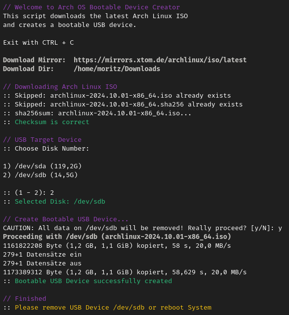

# Arch OS Bootable Device Creator

**[ ➜ One-line POSIX Executable](#run-arch-os-iso-creator)**
<br><sub></sub>

<div align="center">
<p></p>
  <p>
    
    
  </p>
  <p><sub>100% shellcheck approved</sub></p>
  <p><sub>powered by <a href="https://github.com/murkl/arch-os">Arch OS</a></sub></p>
</div>

## Run Bootable Device Creator

This POSIX script downloads the latest [Arch Linux ISO](https://archlinux.org/download/) and creates a bootable USB device.

```
curl -Ls https://raw.githubusercontent.com/murkl/arch-os-creator/refs/heads/main/creator.sh | bash
```

Minimal Auto-Installer: Boot from new created USB Device and install **[ ➜ Arch OS](https://github.com/murkl/arch-os)**

## Dependencies

```
sh curl lsblk sha256sum
```

## Override Variables

```
ARCH_ISO_DOWNLOAD_DIR="~/Downloads"
ARCH_ISO_DOWNLOAD_URL="https://mirrors.xtom.de/archlinux/iso/latest"

# Example
ARCH_ISO_DOWNLOAD_DIR="/tmp" ./creator.sh
```
