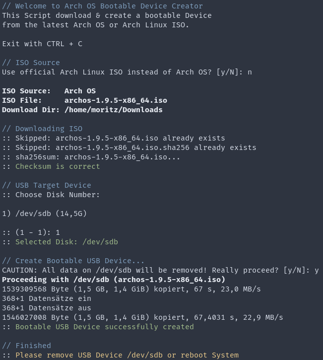

<div align="center">

# Arch OS Creator

**[ ➜ Run One-line POSIX Executable](#create-bootable-usb-device)**

<p></p>
</div>

## Create Bootable USB Device

This POSIX script downloads the latest [Arch OS](https://github.com/murkl/arch-os) or official [Arch Linux](https://archlinux.org/download/) ISO and creates a bootable USB device on Linux.

```
curl -Ls https://raw.githubusercontent.com/murkl/arch-os-creator/refs/heads/main/creator.sh | bash
```

### Dependencies

```
coreutils util-linux grep sed curl sudo ncurses
```

### Environment Variables

The default variables can be overwritten with `export`. The script checks whether the variables are already set at startup.

```
export DOWNLOAD_DIR="~/Downloads"
export ARCH_OS_RELEASES_API="https://api.github.com/repos/murkl/arch-os/releases/latest"
export ARCH_LINUX_ISO_MIRROR="https://mirrors.xtom.de/archlinux/iso/latest"
```

<div align="center">
  <p>
    
    
  </p>
  <p><sub>100% shellcheck approved</sub></p>
  <p><sub>powered by <a href="https://github.com/murkl/arch-os">Arch OS</a></sub></p>
</div>
